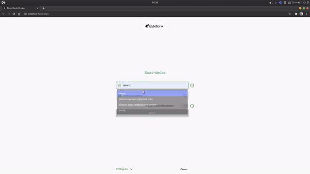

# angular-rxjs-byte-bank-broker

## Tecnologias

* Node.js v12
* Angular cli v10
* RxJS

## Pré-Requisitos

Baixar dependencias dos projetos `api` e `byte-bank-broker` executando dentro de cada diretório o comando:

    `npm install`

## Rodar aplicação

Para rodar o backend executar dentro da pasta `api` o comando:

    `npm start`

Para rodar o frontend executar dentro da pasta `byte-bank-broker` o comando:

    `ng serve -o`

## Usuário

user = alvaro
password = 123

